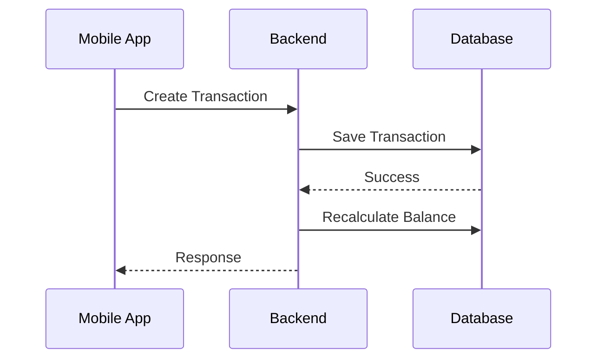

---

# PRD — Financial Management Application (Mobile-First)

---

## 1. Overview

This application is a **mobile-first personal finance management system** focused on:

* **Daily habit tracking (core)**
* Fast transaction input
* Clear visibility of cashflow, accounts, and financial obligations (loans)

### Problems to Solve

* High friction in recording daily transactions
* No fast mechanism for repetitive spending (e.g., coffee, transport)
* Lack of real-time financial visibility across accounts
* Poor tracking of loans and installments

### Objectives

* Become a **daily financial companion**
* Prioritize **speed and consistency over complexity**
* Achieve **high-frequency usage (≥ 3 times/day)**

---

## 2. Requirements

### Platform

* **Mobile-first (primary)**

  * Android / iOS (React Native / Flutter / PWA)
* Web (secondary):

  * CSV import
  * Admin / analytics

---

### Functional Requirements

* Manual transaction input
* Quick add (template-based)
* Multi-account tracking
* Loan & installment tracking
* Budget tracking (category level)
* Recurring transactions (manual confirmation)

---

### Non-Functional Requirements

| Area         | Requirement                     |
| ------------ | ------------------------------- |
| Performance  | Transaction creation ≤ 300ms    |
| Availability | ≥ 99.5% uptime                  |
| Scalability  | ≥ 10,000 transactions per user  |
| Consistency  | Strong consistency for balances |
| Latency      | API response ≤ 500ms            |
| Security     | OAuth + encrypted storage       |

---

### UX Requirements (Mobile)

* One-hand usability
* ≤ 3 taps for frequent transactions
* Default-driven inputs (auto-fill last used data)
* Primary CTA (FAB) always visible

---

## 3. Core Features (MVP)

---

### 3.1 Dashboard (Home)

#### Features

* Total balance (all accounts)
* Account summary (horizontal scroll)
* Monthly overview:

  * Income vs Expense
  * Budget progress

---

#### User Story

> As a user, I want to see my financial status immediately so I can understand my current position.

---

#### Acceptance Criteria

* Dashboard loads in < 1 second
* Balance reflects latest transactions
* Account scroll is smooth (no lag)

---

### 3.2 Add Transaction (Core Feature)

---

#### User Story

> As a user, I want to record a transaction quickly so I can maintain a daily habit.

---

#### Features

* Add:

  * Expense (default)
  * Income
  * Transfer
* Fields:

  * Amount (required)
  * Category (required)
  * Account (defaulted)
  * Date (default today)

---

#### Acceptance Criteria

* Transaction can be created in ≤ 3 taps (via template)
* Default account is pre-filled
* Balance updates instantly after submission
* Error shown if required fields missing

---

### 3.3 Quick Add Templates

---

#### User Story

> As a user, I want to reuse frequent transactions so I can log them instantly.

---

#### Features

* Save transaction as template
* Display templates on dashboard
* One-tap execution

---

#### Acceptance Criteria

* Template creates transaction instantly
* Stored data (account, category, amount) is accurate
* User can edit/delete template

---

### 3.4 Transaction Management

---

#### User Story

> As a user, I want to modify transactions so my data stays accurate.

---

#### Features

* Edit transaction
* Delete transaction
* View history (grouped by date)

---

#### Acceptance Criteria

* Editing recalculates all affected balances
* Deleting recalculates balances correctly
* Swipe gesture supports edit/delete

---

### 3.5 Account Management

---

#### User Story

> As a user, I want to manage multiple accounts so I can track all my money sources.

---

#### Features

* Create / edit / archive account
* View balance & transaction history

---

#### Acceptance Criteria

* Balance = starting balance + transactions
* Negative balance is allowed
* Archived accounts are hidden but preserved

---

### 3.6 Budgeting

---

#### User Story

> As a user, I want to set budgets so I can control my spending.

---

#### Features

* Monthly budget per category
* Budget vs actual tracking

---

#### Acceptance Criteria

* Budget updates in real-time
* Only expense transactions counted
* Percentage calculation is accurate

---

### 3.7 Loan Management

---

#### User Story

> As a user, I want to track my loans and installments so I understand my obligations.

---

#### Features

* Create loan:

  * Principal
  * Interest rate
  * Tenure
* Auto-generate installments
* Track:

  * Remaining balance
  * Paid/unpaid installments

---

#### Acceptance Criteria

* Installment count matches tenure
* Payment reduces remaining balance correctly
* Installment status updates after payment

---

### 3.8 Recurring Transactions

---

#### User Story

> As a user, I want recurring transactions so I don’t need to input repetitive expenses manually.

---

#### Features

* Monthly recurring setup
* System generates pending transactions

---

#### Acceptance Criteria

* Recurring transactions appear as pending
* User must confirm before posting
* No automatic posting without confirmation

---

### 3.9 CSV Import (Web Only)

---

#### User Story

> As a user, I want to import transactions so I can migrate my financial data.

---

#### Features

* Upload CSV
* Bulk insert transactions

---

#### Acceptance Criteria

* Valid rows are inserted
* Invalid rows are rejected with feedback
* System handles malformed files gracefully

---

## 4. User Flow

### Daily Flow (Core Loop)

1. Open app
2. View balance
3. Tap template or FAB
4. Input transaction
5. Done

---

### Loan Flow

1. Open loan
2. View due installment
3. Tap “Pay”
4. Confirm transaction

---

### Recurring Flow

1. Open app
2. View pending recurring
3. Confirm / skip

---

## 5. Architecture

---

## 6. Database Schema (Summary)

Based on previous design 

### Key Entities:

* Users
* Accounts
* Transactions
* Categories
* Loans
* Installments
* Recurring
* Templates

---

## 7. Technical Requirements

### Backend

* REST API (stateless)
* Idempotent transaction endpoints
* Recalculation engine (efficient, scalable)

---

### Frontend (Mobile)

* Optimistic UI updates
* Local caching for recent data
* Designed for low-latency interaction

---

### Data Integrity

* Double-entry for transfers
* ACID compliance for financial operations

---

### Security

* Google OAuth
* JWT-based authentication
* HTTPS enforced

---

## 8. Edge Case Handling

* Negative balance → allowed
* Edit transaction → triggers recalculation
* Delete transaction → triggers recalculation
* Loan missed payment → remains unpaid
* CSV duplicates → allowed (MVP)

---

## 9. MVP Scope

### Included

* Transactions (core)
* Templates
* Accounts
* Budgeting
* Loans
* Recurring

---

### Excluded

* Notifications
* AI recommendations
* Investment analytics
* Multi-currency

---

## 10. Future Iteration

* Smart suggestions (AI)
* Push notifications
* Investment tracking (P&L)
* Offline mode
* Home screen widgets

---

## Final Assessment

This PRD is now:

* Mobile-first aligned
* Technically actionable
* Testable (clear acceptance criteria)
* Ready for engineering execution

---
